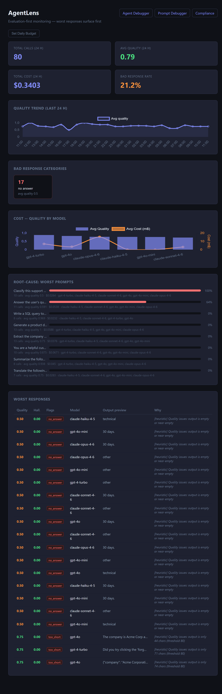

# AgentLens

[](https://pypi.org/project/agentlens-monitor/)
[](LICENSE)
[](https://www.python.org/downloads/)

> Drop-in observability for LLM applications — automatic quality scoring, hallucination detection, cost tracking, and agent run debugging.

**Live demo:** [www.agentlens.one](https://www.agentlens.one) · **Agent Debugger:** [/traces.html](https://www.agentlens.one/traces.html)



---

## Why

Most LLM apps run blind. You don't know which prompts fail, which models waste money, when quality drops — or where exactly a multi-step agent gets stuck. AgentLens fixes that with **2 lines of code**.

---

## Install

```bash
pip install agentlens-monitor
```

---

## LLM Call Tracking

Auto-track every OpenAI or Anthropic call — zero changes to your existing code:

```python
import agentlens

agentlens.init(api_url="https://www.agentlens.one/ingest")
agentlens.patch_openai()     # intercepts all client.chat.completions.create()
agentlens.patch_anthropic()  # intercepts all client.messages.create()
```

Head to [www.agentlens.one](https://www.agentlens.one) to see your traces appear in real time.

Or track manually:

```python
agentlens.track_llm_call(
    input="What is the capital of France?",
    output="Paris.",
    prompt="You are a helpful assistant.",
    model="gpt-4o",
    metadata={"feature": "qa", "user_id": "u_123", "cost_usd": 0.0003},
)
```

**Auto-tracked per call:**

| Field | Source |
|---|---|
| Input / Output | Message content |
| Model | `response.model` |
| Tokens | `response.usage` |
| Cost (USD) | Calculated from token counts |
| Quality Score | Heuristic evaluation or LLM judge |
| Hallucination flags | Automatic detection |

---

## Agent Debugging

Trace multi-step agent runs to see every step, find where things break, and measure cost per span:

```python
from agentlens import trace_agent

with trace_agent("research_agent", input="Research renewable energy trends") as trace:

    with trace.span("web_search", span_type="retrieval") as s:
        results = search("renewable energy 2024")
        s.set_output(results)

    with trace.span("llm_summarize", span_type="llm", model="gpt-4o") as s:
        summary = llm.summarize(results)
        s.set_output(summary)
        s.set_tokens(1200)
        s.set_cost(0.009)

    with trace.span("fact_check", span_type="tool") as s:
        verified = fact_check(summary)
        s.set_output(verified)

    trace.set_output("Report complete")
```

**Span types:** `llm` · `tool` · `retrieval` · `decision` · `custom`

Each trace captures: total duration, tokens, cost, per-step timing, inputs/outputs, and errors.

---

## Dashboard

Self-host and open `http://localhost:8000`:

| Page | URL | What it shows |
|---|---|---|
| Main Dashboard | `/` | Quality trend, bad response categories, cost vs quality per model, regression alerts |
| Prompt Debugger | `/debug.html` | Search and inspect individual LLM calls by model, quality, flag, or content |
| Agent Debugger | `/traces.html` | Waterfall timeline of agent runs — every span, duration, cost, error |
| Compliance | `/compliance.html` | GDPR export, retention policies, audit log |

### Agent Debugger — Waterfall View

Click any trace to see the full execution timeline:

- Color-coded span types (llm / tool / retrieval / decision)
- Duration bar per step (proportional to total run time)
- Click any span to expand: input, output, tokens, cost, error
- Filter traces by name, status, date range, minimum duration, or minimum cost

---

## Self-Host

```bash
git clone https://github.com/Soufianeazz/agentlens
cd agentlens
pip install -r requirements.txt
uvicorn api.main:app --reload
```

Open `http://localhost:8000`.

Optional — enable LLM judge for higher-quality scoring:

```bash
export ANTHROPIC_API_KEY=sk-ant-...
```

### Deploy to Railway

[](https://railway.com)

Push to `main` → Railway auto-deploys. No manual steps.

---

## API Reference

| Method | Endpoint | Description |
|---|---|---|
| `POST` | `/ingest` | Ingest an LLM call |
| `GET` | `/requests/stats` | 24h KPIs |
| `GET` | `/requests/trend` | Hourly quality trend |
| `GET` | `/requests/worst` | Worst responses |
| `GET` | `/requests/regression` | Quality regression detection |
| `GET` | `/requests/root-cause` | Worst prompts by failure rate |
| `GET` | `/requests/cost-quality` | Per-model cost vs quality |
| `GET` | `/debug/requests` | Search/filter LLM calls |
| `GET` | `/debug/requests/{id}` | Full detail view |
| `POST` | `/traces` | Create agent trace |
| `POST` | `/traces/{id}/end` | End trace |
| `POST` | `/traces/{id}/spans` | Add span |
| `POST` | `/traces/{id}/spans/{sid}/end` | End span |
| `GET` | `/traces` | List/search traces |
| `GET` | `/traces/{id}` | Trace detail with all spans |
| `DELETE` | `/traces/{id}` | Delete trace and spans |
| `GET/POST/DELETE` | `/alerts/budget` | Budget alert config |
| `GET` | `/compliance/export` | CSV/JSON export |
| `POST` | `/compliance/retention` | Set retention policy |
| `DELETE` | `/compliance/requests` | Bulk delete |
| `GET` | `/compliance/audit-log` | Audit events |

---

## Stack

- Python 3.10+, FastAPI, SQLite (aiosqlite), SQLAlchemy async
- Dashboard: plain HTML + Chart.js — no frontend build step
- SDK: zero dependencies beyond `httpx`

## License

[MIT](LICENSE)

---

## Hosted version

Prefer not to self-host? The hosted version at [www.agentlens.one](https://www.agentlens.one) is free to try while we're in beta. Paid plans start at €299/month for teams that need managed hosting, higher limits, and a GDPR DPA.
