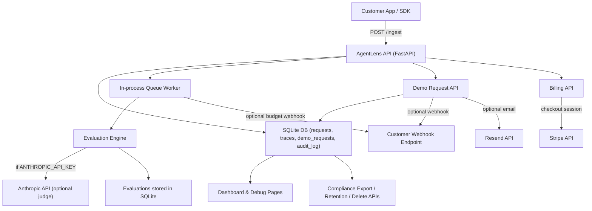

# Subprocessor List and Data Flow v1

Stand: 2026-05-02
Owner: Security + Legal
Status: Draft v1 (to validate before external publication)

## 1. Scope
- This document covers subprocessors used by the hosted AgentLens service.
- Self-hosted customer deployments may use a different vendor set.
- Regions and transfer mechanisms must be confirmed in production account settings before external sharing.

## 2. Subprocessor List (v1)

| Subprocessor | Purpose | Data Categories | Region | Transfer/Legal Basis | Status |
|---|---|---|---|---|---|
| Railway | Application hosting, runtime, and persistent volume for SQLite database | LLM call payloads, metadata, audit data, account-related records, logs | Configured in Railway project (to confirm exact region) | DPA + SCCs as needed | Active |
| Anthropic (optional) | LLM judge for quality scoring in evaluation pipeline (`ANTHROPIC_API_KEY`) | Truncated prompt/input/output segments used for scoring | Anthropic service region per account configuration | DPA/SCCs as needed | Optional |
| Stripe (optional) | Checkout and subscription billing (`/billing/checkout/{plan}`) | Billing metadata, plan selection, payment session data | Stripe region per account configuration | Stripe DPA | Optional |
| Resend (optional) | Email notifications for demo requests (`RESEND_API_KEY`) | Lead contact data (name, email, company, message) | Resend region per account configuration | Resend DPA | Optional |
| Customer-configured webhook endpoint (optional) | Outbound notifications for demo requests and budget alerts | Event payloads including operational and lead metadata | Defined by customer endpoint | Customer-controlled destination | Optional |

## 3. Non-subprocessor Notes
- OpenAI and Anthropic APIs used by SDK users in their own apps are customer-side integrations and not automatically subprocessors of hosted AgentLens.
- GitHub/PyPI are distribution/dev channels and are not in the primary production data path for customer runtime data.

## 4. Data Flow Diagram v1

## 5. Change Management for Subprocessors
- Additions or major changes require:
  - Security review
  - Legal review
  - Update of this list and customer-facing security documentation
- Target notice period for customer-facing updates: 30 days when contractually required.

## 6. Open Validation Items (before external publication)
- Confirm exact production hosting region in Railway.
- Confirm legal entity names and DPA links for each listed subprocessor.
- Confirm whether optional features are enabled in current production environment.
